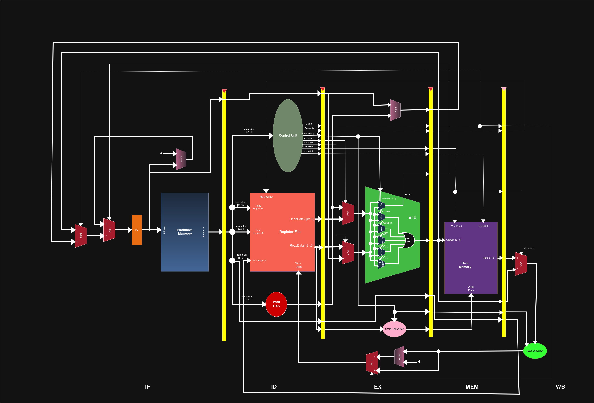
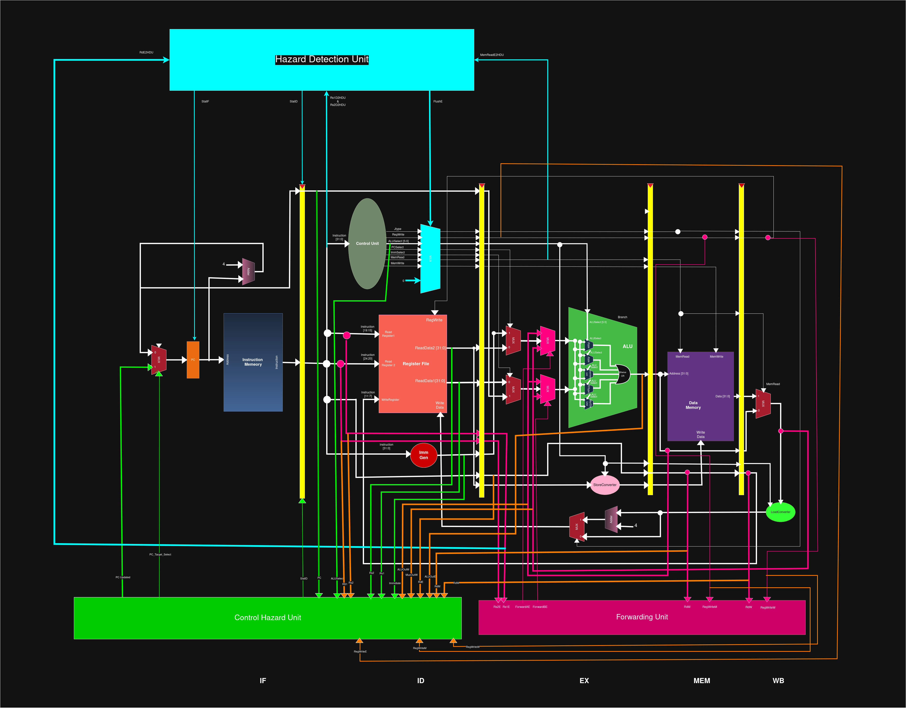

# 🚀 RISC-V RV32I/M 5-Stage Pipelined Processor with Hazard Handling & Assembler

> A fully functional 32-bit RISC-V pipelined processor implementing the **RV32I** base instruction set and **RV32M** (Multiply/Divide) extension, built in **Verilog HDL** — complete with hazard handling, forwarding, and a custom Python assembler toolchain.

---

## 📌 Overview

This project implements a **32-bit RISC-V processor** based on the **RV32I base instruction set** with the **RV32M (Multiply/Divide) extension** using **Verilog HDL**.

The processor follows a classic **5-stage pipelined architecture** and incorporates:

- ✅ Data hazard resolution using **Forwarding (Bypassing)**
- ✅ Load-use hazard handling using **Pipeline Stalling**
- ✅ Control hazard handling using **Pipeline Flushing**
- ✅ A custom **Python-based assembler** for converting assembly programs into `.hex` machine code
- ✅ A complete **testbench** with waveform output for verification

> 💡 This is a complete **hardware + software co-design system** — from writing assembly code, assembling it into machine code, executing it on a pipelined hardware processor, and verifying the result using waveform analysis.

---

## 🏗️ Repository Structure

```text
riscv-pipelined-cpu/
│
├── README.md
├── LICENSE
│
├── docs/
│   ├── basic_datapath.png            # Basic 5-stage pipeline datapath diagram
│   └── hazard_datapath.png           # Hazard-handled datapath with forwarding & stall
│
├── src/
│   │
│   ├── fetch/
│   │   ├── Fetch_cycle.v             # IF stage top module
│   │   ├── Program_Counter.v         # PC register
│   │   ├── Instruction_Mem.v         # Instruction memory (ROM)
│   │   └── PCplus4.v                 # PC+4 adder
│   │
│   ├── decode/
│   │   ├── decode_cycle.v            # ID stage top module
│   │   ├── ControlUnit.v             # Instruction decoder & control signal generator
│   │   ├── Reg_File.v                # 32x32 register file
│   │   └── ImmGen.v                  # Immediate value generator
│   │
│   ├── execute/
│   │   ├── execution_cycle.v         # EX stage top module
│   │   ├── ALU.v                     # Top-level ALU
│   │   ├── RItype.v                  # R-type and I-type arithmetic/logic
│   │   ├── Utype.v                   # U-type (LUI, AUIPC)
│   │   ├── Jtype.v                   # J-type (JAL, JALR)
│   │   ├── muldiv.v                  # RV32M Multiply/Divide unit
│   │   ├── Mux_3_by_1                # 3x1 Multiplexer
│   │   └── LoadStoreUnit.v           # Address calculation for loads/stores
│   │
│   ├── memory/
│   │   ├── Mem_cycle.v               # MEM stage top module
│   │   ├── DataMemory.v              # Data memory (RAM)
│   │   ├── LoadConverter.v           # Byte/halfword load conversion
│   │   └── StoreConverter.v          # Byte/halfword store conversion
│   │
│   ├── writeback/
│   │   └── WriteBack_Cycle.v         # WB stage: result selection & register write
│   │
│   ├── pipeline_registers/
│   │   ├── IF_ID_Register.v          # Pipeline register: Fetch → Decode
│   │   ├── ID_EX_Register.v          # Pipeline register: Decode → Execute
│   │   ├── EX_MEM_Register.v         # Pipeline register: Execute → Memory
│   │   └── MEM_WB_Register.v         # Pipeline register: Memory → Writeback
│   │
│   ├── hazard/
│   │   ├── forwarding_unit.v         # Data hazard forwarding logic
│   │   ├── Hazard_Detection_Unit.v   # Load-use hazard stall logic
│   │   ├── Control_Hazard_Unit.v     # Branch/jump flush logic
│   │	└── Masking_Mux_CU            # Mask the Control Unit outputs when the Hazard Detection Unit wants to flush
│   │
│   │
│   ├── Adder.v			      # General Adder
│   ├── Mux.v			      # 2x1 Multiplexer
│   │
│   └── top_cpu.v                     # Top-level CPU integration module
│
├── assembler/
│   ├── assembler.py                  # Custom RISC-V Python assembler
│   └── Instructions_To_Use_Assembler.txt  # Usage guide for the assembler
│
├── test/
│   ├── top_cpu_tb.v                  # Simulation testbench
│   ├── fibonacci.s                     # Example RISC-V assembly program
│   ├── fibonacci.hex                   # Assembled machine code
│   └── top_cpu.vcd                   # Simulation waveform output
│
├── examples/
│    └── factorial.s              # Additional example programs
│
└── Lab_Report.pdf

```

---

## 🏗️ Processor Architecture

### 🔷 Basic Pipeline Datapath



The basic datapath shows the classic **5-stage pipeline** without hazard handling. Instructions flow linearly through **IF → ID → EX → MEM → WB**, with each stage separated by a pipeline register that holds the instruction's data between clock cycles.

### 🔷 Hazard-Handled Datapath



The hazard-handled datapath extends the basic design with:

- **Forwarding paths** from EX/MEM stages back to the EX stage input
- **Stall signals** from the Hazard Detection Unit to freeze the PC and IF/ID register
- **Flush signals** from the Control Hazard Unit to clear incorrectly fetched instructions

---

## 🧠 Pipeline Stages

| Stage | Module | Description |
|-------|--------|-------------|
| **IF** — Instruction Fetch | `Fetch_cycle.v` | Fetches instruction from memory using the Program Counter. PC is updated to PC+4 by default, or redirected on branch/jump. |
| **ID** — Instruction Decode | `decode_cycle.v` | Decodes the instruction opcode, reads source registers from the register file, generates control signals, and sign-extends immediate values. |
| **EX** — Execute | `execution_cycle.v` | Performs ALU operations (arithmetic, logic, comparison), calculates memory addresses for loads/stores, and evaluates branch conditions. |
| **MEM** — Memory Access | `Mem_cycle.v` | Reads from or writes to data memory for load/store instructions. Non-memory instructions pass through unchanged. |
| **WB** — Write Back | `WriteBack_Cycle.v` | Selects the final result (from ALU, memory, or PC+4) and writes it back to the destination register in the register file. |

---

## ⚡ Pipeline Hazards — Detailed Explanation

A **pipeline hazard** is a condition that prevents the next instruction in the pipeline from executing correctly in the following clock cycle. There are three types of hazards, each requiring a different mitigation strategy.

---

### 🔴 1. Data Hazards

#### 🔍 What Is a Data Hazard?

A data hazard occurs when an instruction **depends on the result of a previous instruction** that has not yet completed its pipeline stages. Because instructions are overlapping in the pipeline, the required value may not yet be written to the register file when the dependent instruction reaches its EX stage.

#### 📌 Example

```assembly
add x1, x2, x3    # x1 is written in WB (cycle 5)
sub x4, x1, x5    # x1 is needed in EX (cycle 4) — NOT YET READY
```

Without any mitigation, `sub` would read a **stale (incorrect) value** of `x1` from the register file.

#### ✅ Solution: Forwarding (Bypassing)

Instead of waiting for `x1` to be written back to the register file, the result is **forwarded directly** from the pipeline register where it already exists.

**Forwarding paths implemented:**

| Source Stage | Destination | When Used |
|---|---|---|
| EX/MEM pipeline register | EX stage ALU input | Result from 1 instruction ago |
| MEM/WB pipeline register | EX stage ALU input | Result from 2 instructions ago |

The **Forwarding Unit** continuously monitors the source registers of the instruction in EX and compares them against the destination registers of instructions in MEM and WB. When a match is found, it selects the forwarded value via a multiplexer instead of the register file output.

#### 📄 Implementation

```text
src/hazard/forwarding_unit.v
```

#### 💡 Design Decision

Forwarding was chosen over stalling because it **avoids pipeline bubbles entirely** for most data hazards, keeping the pipeline full and maximising throughput. The cost is additional multiplexers and comparison logic, which is a worthwhile trade-off.

---

### 🟡 2. Load-Use Hazard

#### 🔍 What Is a Load-Use Hazard?

A load-use hazard is a **special case of a data hazard** that forwarding alone cannot resolve. It occurs when a `load` instruction is immediately followed by an instruction that uses the loaded value. The load result is not available until **after the MEM stage**, but the dependent instruction needs it at the **start of EX**.

#### 📌 Example

```assembly
lw  x1, 0(x2)     # x1 loaded from memory — result ready after MEM
add x3, x1, x4    # x1 needed in EX — but MEM hasn't happened yet
```

Even with forwarding, there is a **one-cycle gap** that cannot be bridged.

#### ✅ Solution: Pipeline Stall (Bubble Insertion)

When the Hazard Detection Unit identifies a load-use dependency, it **stalls the pipeline for exactly one cycle**:

1. The **Program Counter (PC)** is frozen — it does not advance
2. The **IF/ID pipeline register** is frozen — the fetched instruction is held
3. A **NOP (bubble)** is inserted into the ID/EX register — a do-nothing instruction flows through EX
4. After one cycle, forwarding can now deliver the loaded value from MEM/WB to EX

#### 📄 Implementation

```text
src/hazard/Hazard_Detection_Unit.v
```

#### 💡 Design Decision

The stall is inserted **only when absolutely necessary** — specifically when `ID/EX.MemRead = 1` and the load destination matches a source register of the next instruction. This minimises the performance cost while guaranteeing correctness.

---

### 🔵 3. Control Hazards

#### 🔍 What Is a Control Hazard?

A control hazard arises from **branch and jump instructions**. When a branch is encountered, the processor does not yet know whether the branch will be taken (and what the target address will be) until the **EX stage**. However, by that time, the next 1–2 instructions have already been fetched from the wrong address.

#### 📌 Example

```assembly
beq x1, x2, LABEL   # branch decision resolved in EX
add x5, x6, x7      # already fetched — may be WRONG instruction
```

If the branch is taken, `add` was fetched incorrectly and must not execute.

#### ✅ Solution: Pipeline Flush

When the Control Hazard Unit detects that a branch has been taken (or a jump is encountered):

1. The **incorrectly fetched instructions** in IF and ID stages are **flushed** (replaced with NOPs)
2. The **PC is updated** to the correct branch/jump target address
3. Execution continues from the correct instruction

#### 📄 Implementation

```text
src/hazard/Control_Hazard_Unit.v
```

#### 💡 Design Decision

A **flush-based approach without branch prediction** was chosen for simplicity and correctness. While branch prediction would reduce the penalty for taken branches, the added complexity is not warranted for an educational processor. The current design always flushes on a taken branch, incurring a **2-cycle penalty** per taken branch.

---

## ⚙️ Key Design Decisions

### 🔹 Modular Stage Architecture

Each pipeline stage (`Fetch_cycle.v`, `decode_cycle.v`, etc.) is implemented as a **self-contained module**. This makes the design easier to read, debug, and extend. Individual modules can be tested in isolation before integration.

### 🔹 Separate Pipeline Registers

Dedicated pipeline registers (`IF_ID_Register.v`, `ID_EX_Register.v`, etc.) separate each stage. They store all the data and control signals that the downstream stage needs, ensuring **clean timing** and **no combinational paths** crossing stage boundaries.

### 🔹 Forwarding-First Hazard Strategy

The design **resolves as many hazards as possible through forwarding** before resorting to stalling. This maximises pipeline utilisation. Stalls are only introduced for the unavoidable load-use case.

### 🔹 Decomposed ALU

Rather than a monolithic ALU, the execute stage is divided into **functional submodules**:

| Module | Function |
|--------|----------|
| `RItype.v` | R-type and I-type arithmetic, logic, shifts, comparisons |
| `Utype.v` | U-type: LUI and AUIPC |
| `Jtype.v` | J-type: JAL and JALR |
| `muldiv.v` | RV32M: MUL, MULH, DIV, DIVU, REM, REMU |

This decomposition makes it straightforward to add new functional units (e.g., floating-point) in the future.

### 🔹 Combinational Control Unit

The `ControlUnit.v` generates all control signals **combinationally** from the instruction opcode, funct3, and funct7 fields. This means control signals are available immediately in the same cycle as decode, without adding pipeline latency.

### 🔹 Simple Memory Model

Both instruction and data memories are simple synchronous arrays, initialised from `.hex` files. No cache hierarchy is included — the focus is on **pipeline behaviour and hazard handling**, not memory performance.

---

## 🔄 Complete System Flow

```
  [ RISC-V Assembly Program (.s) ]
              ↓
    assembler/assembler.py
              ↓
   [ Machine Code (.hex file) ]
              ↓
  Loaded into Instruction Memory
              ↓
  ┌─────────────────────────────────────────┐
  │         5-Stage Pipelined CPU           │
  │  IF → ID → EX → MEM → WB               │
  │  (with Forwarding, Stall, Flush)        │
  └─────────────────────────────────────────┘
              ↓
  [ Simulation Waveform Output (.vcd) ]
              ↓
    Viewed in GTKWave
```

---

## 🧰 Custom Assembler

The project includes a **Python-based RISC-V assembler** (`assembler/assembler.py`) that converts human-readable RISC-V assembly into binary machine code encoded in `.hex` format for loading into instruction memory.

### Supported Instruction Formats

| Format | Examples |
|--------|---------|
| R-type | `ADD`, `SUB`, `AND`, `OR`, `XOR`, `SLL`, `SRL`, `SRA`, `SLT`, `MUL`, `DIV`, `REM` |
| I-type | `ADDI`, `ANDI`, `ORI`, `LW`, `LH`, `LB`, `JALR` |
| S-type | `SW`, `SH`, `SB` |
| B-type | `BEQ`, `BNE`, `BLT`, `BGE`, `BLTU`, `BGEU` |
| U-type | `LUI`, `AUIPC` |
| J-type | `JAL` |

### Features

- Label resolution for branch and jump targets
- Decimal and hexadecimal immediate parsing
- Memory operand syntax (`offset(register)`)
- Outputs `.hex` file ready for simulation

### Usage

```bash
python assembler/assembler.py test/program.s test/program.hex
```

---

## 🚀 Getting Started

### Prerequisites

- [Icarus Verilog](http://iverilog.icarus.com/) — for Verilog compilation and simulation
- [GTKWave](http://gtkwave.sourceforge.net/) — for waveform viewing
- [Python 3](https://www.python.org/) — for running the assembler

### Step 1 — Clone the Repository

```bash
git clone https://github.com/<your-username>/riscv-pipelined-cpu.git
cd riscv-pipelined-cpu
```

### Step 2 — Write or Use an Existing Assembly Program

An example program is provided at `test/program.s`. To assemble it:

```bash
python assembler/assembler.py test/fibonacci.s test/fibonacci.hex
```

### Step 3 — Compile All Verilog Sources

```bash
iverilog -o cpu_sim \
  src/fetch/*.v \
  src/decode/*.v \
  src/execute/*.v \
  src/memory/*.v \
  src/writeback/*.v \
  src/pipeline_registers/*.v \
  src/hazard/*.v \
  src/*.v \
  test/top_cpu_tb.v
```

### Step 4 — Run the Simulation

```bash
vvp cpu_sim
```

### Step 5 — View the Waveform

```bash
gtkwave top_cpu.vcd
```

> ⚠️ **Note:** Ensure your testbench (`top_cpu_tb.v`) contains the following for waveform generation:
> ```verilog
> initial begin
>     $dumpfile("top_cpu.vcd");
>     $dumpvars(0, top_cpu_tb);
> end
> ```

---

## 🧪 Example Program

```assembly
addi x1, x0, 5     # x1 = 5
addi x2, x0, 10    # x2 = 10
add  x3, x1, x2    # x3 = x1 + x2
```

**Expected Result:**

```
x3 = 15
```

---

## 🧩 Supported Instruction Set

### RV32I Base Instructions

| Type | Instructions |
|------|-------------|
| Arithmetic | `ADD`, `SUB`, `ADDI` |
| Logical | `AND`, `OR`, `XOR`, `ANDI`, `ORI`, `XORI` |
| Shift | `SLL`, `SRL`, `SRA`, `SLLI`, `SRLI`, `SRAI` |
| Compare | `SLT`, `SLTU`, `SLTI`, `SLTIU` |
| Load | `LW`, `LH`, `LB`, `LHU`, `LBU` |
| Store | `SW`, `SH`, `SB` |
| Branch | `BEQ`, `BNE`, `BLT`, `BGE`, `BLTU`, `BGEU` |
| Upper Imm | `LUI`, `AUIPC` |
| Jump | `JAL`, `JALR` |

### RV32M Extension

| Instruction | Operation |
|-------------|-----------|
| `MUL` | Multiply (lower 32 bits) |
| `MULH` | Multiply high signed×signed |
| `MULHSU` | Multiply high signed×unsigned |
| `MULHU` | Multiply high unsigned×unsigned |
| `DIV` | Signed divide |
| `DIVU` | Unsigned divide |
| `REM` | Signed remainder |
| `REMU` | Unsigned remainder |

---

## 🔬 Verification

| Item | File | Description |
|------|------|-------------|
| Testbench | `test/top_cpu_tb.v` | Drives the CPU with instructions and checks outputs |
| Hex Program | `test/program.hex` | Machine code loaded into instruction memory |
| Waveform | `test/top_cpu.vcd` | Signal transitions for all pipeline stages |

**Verified Behaviours:**

- ✔ Instruction fetch and PC update
- ✔ Correct instruction decoding and control signal generation
- ✔ ALU operations for all RV32I and RV32M instruction types
- ✔ Branch taken and branch not taken behaviour
- ✔ JAL and JALR jump execution
- ✔ Load and store operations (byte, halfword, word)
- ✔ Forwarding paths (EX→EX and MEM→EX)
- ✔ Load-use stall insertion
- ✔ Branch flush correctness

---

## 📈 Future Improvements

| Feature | Description |
|---------|-------------|
| Branch Prediction | Reduce branch penalty from 2 cycles |
| Instruction Cache | Reduce average fetch latency |
| Data Cache | Improve memory access performance |
| AXI Interface | Enable SoC integration |
| Out-of-Order Execution | Improve IPC for complex workloads |
| Floating-Point Unit | Add RV32F support |
| Exception Handling | Trap and interrupt support |

---

## 🧠 Learning Outcomes

By studying this project, you will learn:

- How a **5-stage RISC-V pipeline** works in detail
- Why pipeline hazards occur and how each type is handled
- How **forwarding** eliminates most data hazard stalls
- How **stalling** handles the load-use case that forwarding cannot
- How **flushing** corrects the pipeline after a taken branch
- How to design a **modular RTL system** in Verilog
- How a **custom assembler** converts assembly into machine code
- How to simulate and verify hardware with **Icarus Verilog and GTKWave**

---

## 👥 Authors

**Group 04**

E/17/083 - Mahela Ekanayake
E/19/455 - Vidura Yashan

CO502 - Advanced Computer Architecture Project  
Department of Computer Engineering  
University of Peradeniya

---

## ⭐ Final Note

This project demonstrates a complete CPU design workflow that mirrors real-world engineering practice:

- **Architecture** — Pipeline design with hazard handling
- **RTL Implementation** — Modular Verilog design
- **Verification** — Testbench-driven simulation with waveform analysis
- **Toolchain** — Custom assembler for program execution

The design is directly relevant to roles in **ASIC design**, **FPGA development**, **computer architecture research**, and **hardware-software co-design**.


## 📜 License

This project is licensed under the **MIT License** — see the [LICENSE](LICENSE) file for details.

You are free to use, modify, and distribute this project with attribution.
